# LIRI Bot
Assignment 8 - LIRI Bot

## Author
A Newman

## Overview Description
Homework Assignment 8 - LIRI Bot
SMU Programming Bootcamp Spring 2019

The purpose of this assignment is to create a node.js based LIRI app.  LIRI is a _Language_ Interpretation and Recognition Interface. LIRI is a command line node app that takes in parameters and gives back data. LIRI quiries Spotify for songs, Bands in Town for concerts, and OMDB for movies.

Please see the Homework-Instructions.md file for the specific assignment requirements.

I deviated from the homework instructions in that I added an extra option for the user to be prompted to input the action and the search string.

## Node Packages Used
The following packages are needed (npm install) to run the program

   * [Axios](https://www.npmjs.com/package/axios)

   * [Node-Spotify-API](https://www.npmjs.com/package/node-spotify-api)

   * [OMDB API](http://www.omdbapi.com)
   
   * [Bands In Town API](http://www.artists.bandsintown.com/bandsintown-api)

   * [Moment](https://www.npmjs.com/package/moment)

   * [DotEnv](https://www.npmjs.com/package/dotenv)

   * [Request](https://www.npmjs.com/package/request)

   * [FS](https://www.npmjs.com/package/fs)

## Prior to Running the Program
The Node-Spotify-APE requires a set of API Keys. Create a file named `.env`, add the following to it, replacing the values with your API keys (no quotes) once you have them:

```js
# Spotify API keys

SPOTIFY_ID=your-spotify-id
SPOTIFY_SECRET=your-spotify-secret

```

## Running The Program from the BASH command line.
In the project directory, the program can be executed at the command line in two ways: 

### User Prompt
The program can be run as follows and will prompt the user for input.

node liri.js

The program will prompt you for the type of action you want to perform:

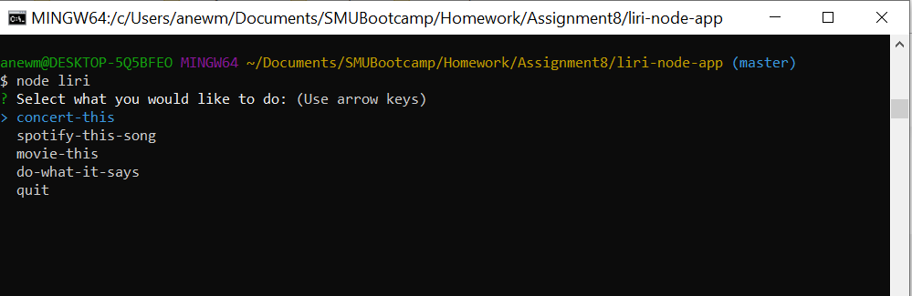

Use the arrow keys to highlight the desired action and press enter.

Next, the program will prompt you to enter either a corresponding seach string (for concert-this, spotify-this-song, or movie-this) or the name of the file containing both the action and the search string.  Note, the format of the command/string in the file should be "command,string".  For example, 

spotify-this-song,Abracadabra
movie-this,Star Wars
concert-this,Goo Goo Dolls

### Command Line Input
Use the following command line syntax to input the requested action and search string.

node liri.js command searchStr

Where command is one of the following and searchStr (no quotes):

spotify-this-song 'song name'
movie-this 'movie name'
concert-this 'artist/band name'
do-what-it-says 'filename'


## Test Runs

The following are screen captures of each of the test runs where both the action and the search string were entered:

### node liri concert-this Theory of a Deadman
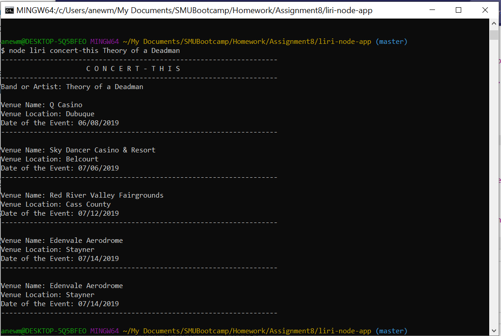

### node liri spotify-this-song Hound Dog
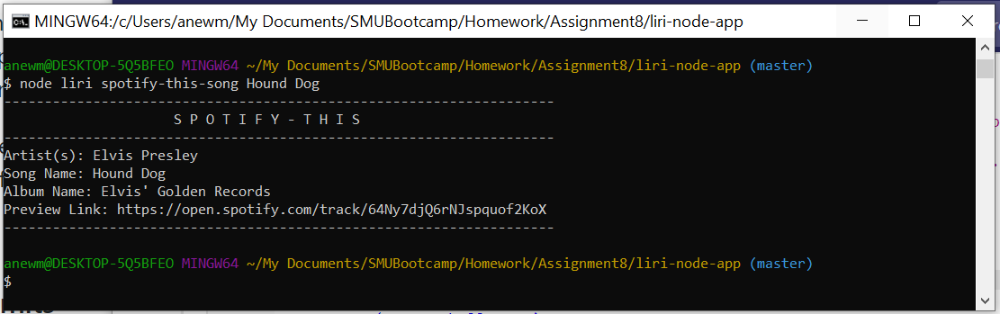

### node liri movie-this Space Odyssey
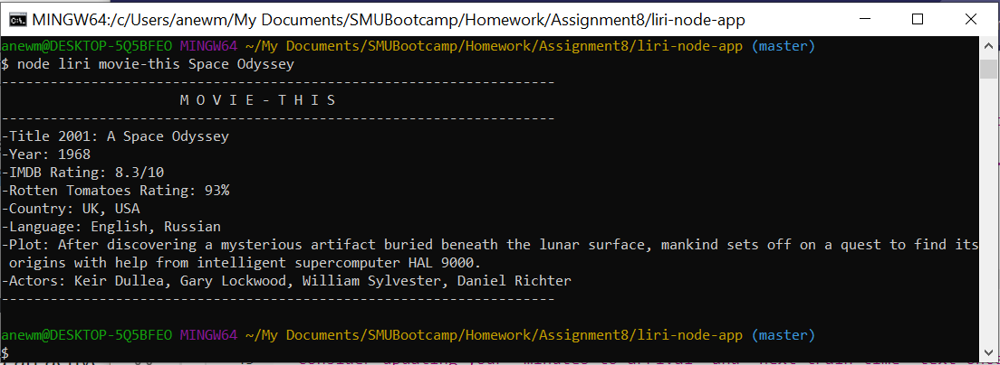

The following are screen captures of each of the test runs for the "do-what-it-says <filename>" option.  It was run 3 times with a band, a song and a movie:
  
### node liri do-what-it-says concert.txt
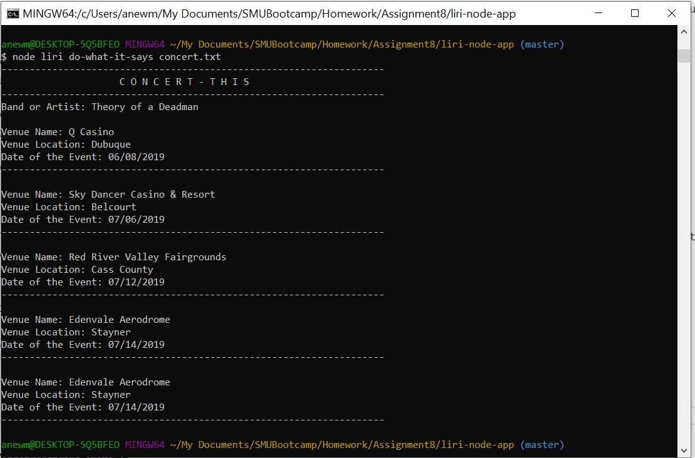

### node liri do-what-it-says spotify.txt
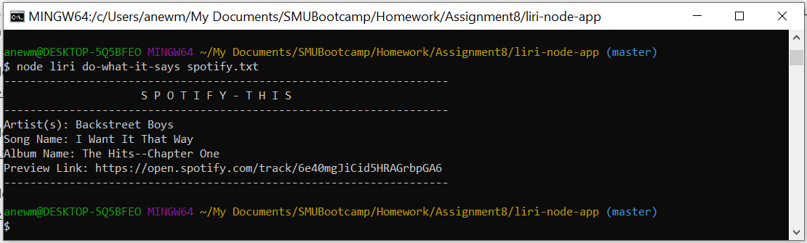

### node liri do-what-it-says movie.txt
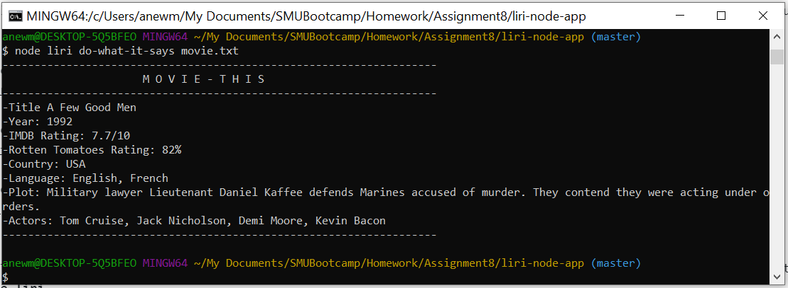


BONUS- The following are screen captures of each test run with no action or search string causing the user to be prompted for the information:
### node liri 
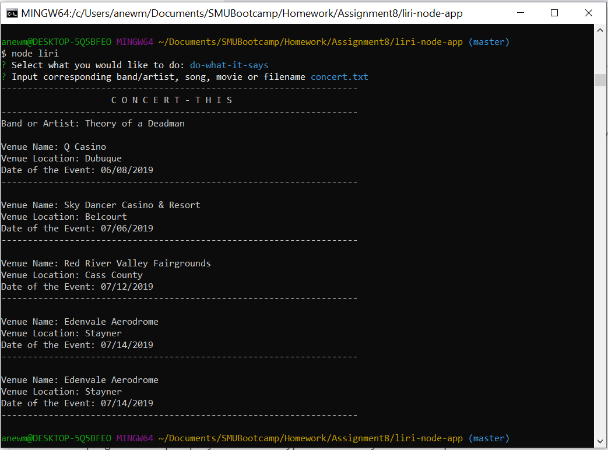

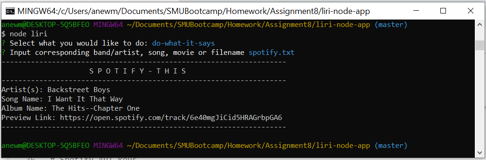

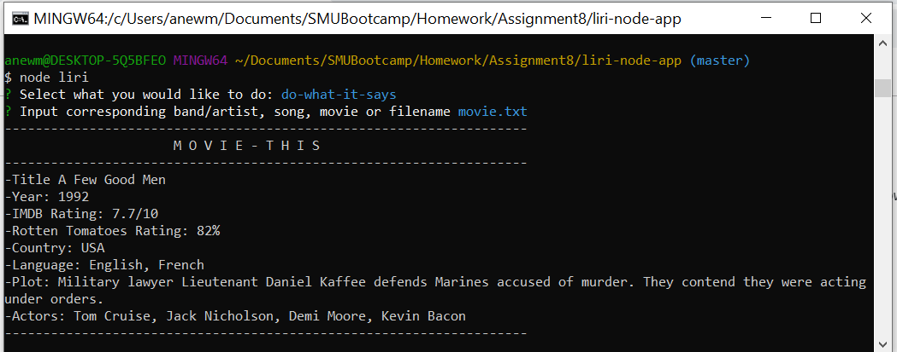

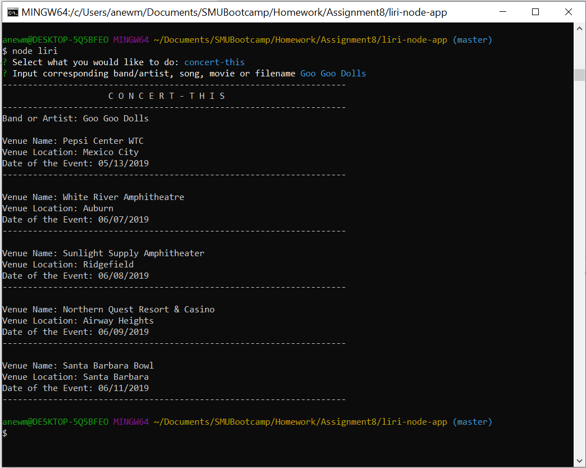

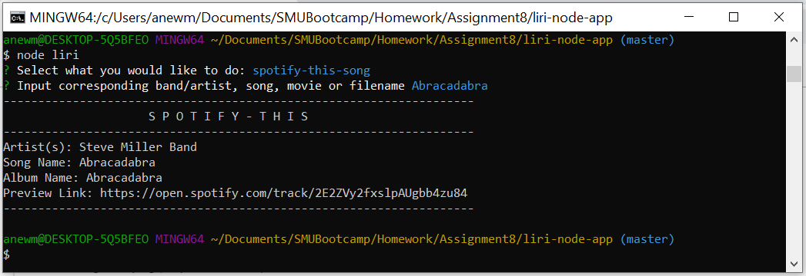

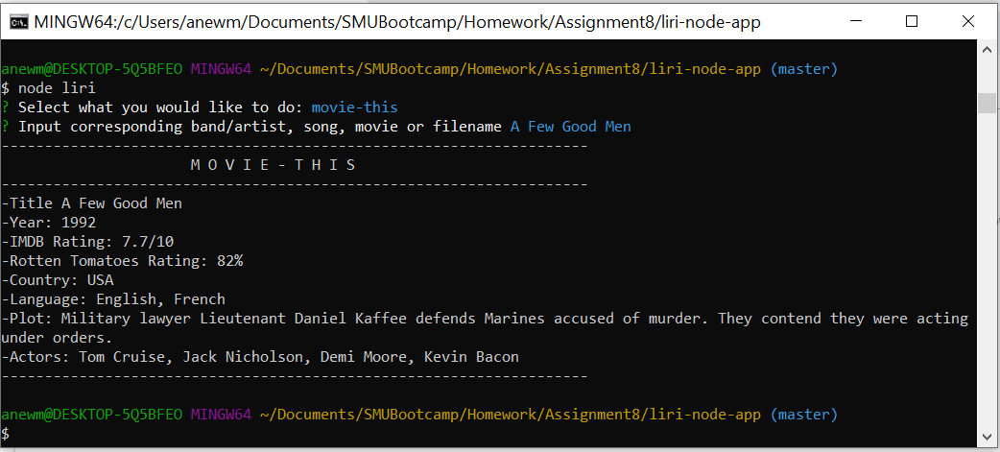


